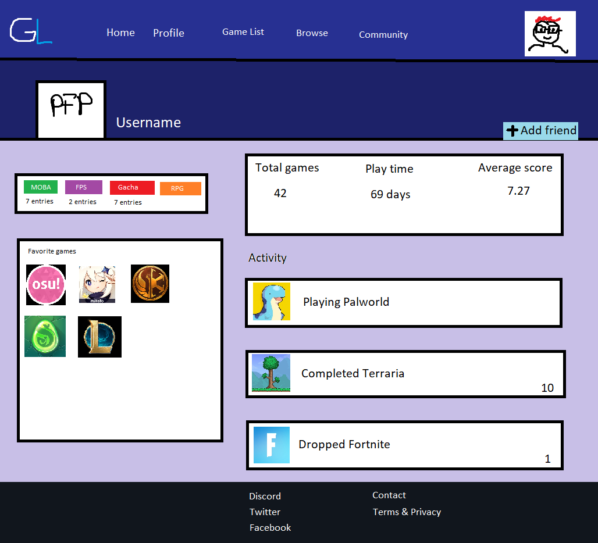
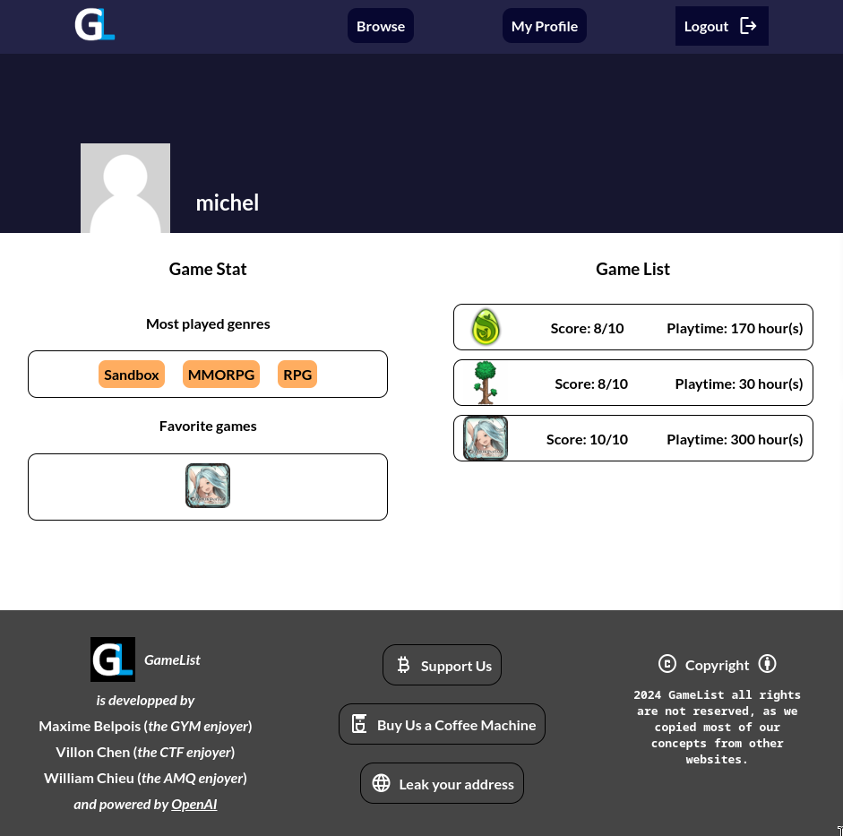

# GameList

## Preview

Expectation: 

Reality: 

## Project Setup

Install dependencies:
```sh
npm install
```

Compile and Hot-Reload for Development:
```sh
npm run dev
```

Compile and Minify for Production:
```sh
npm run build
```
